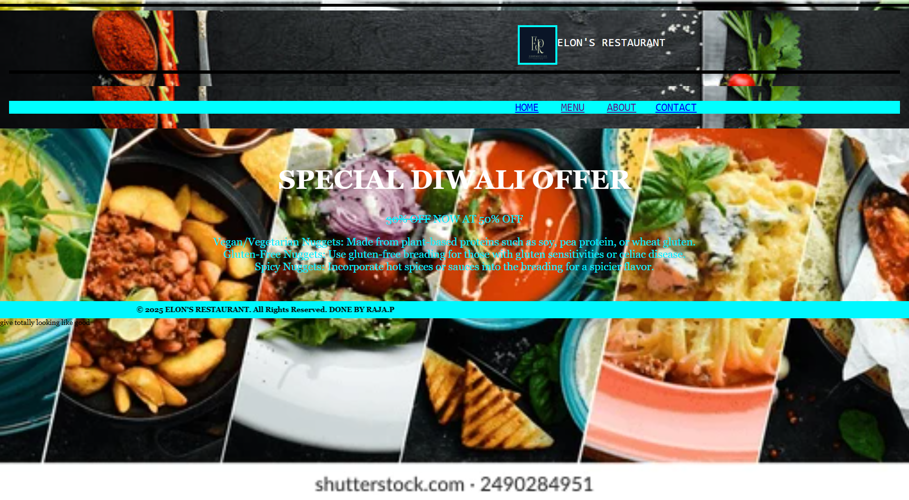
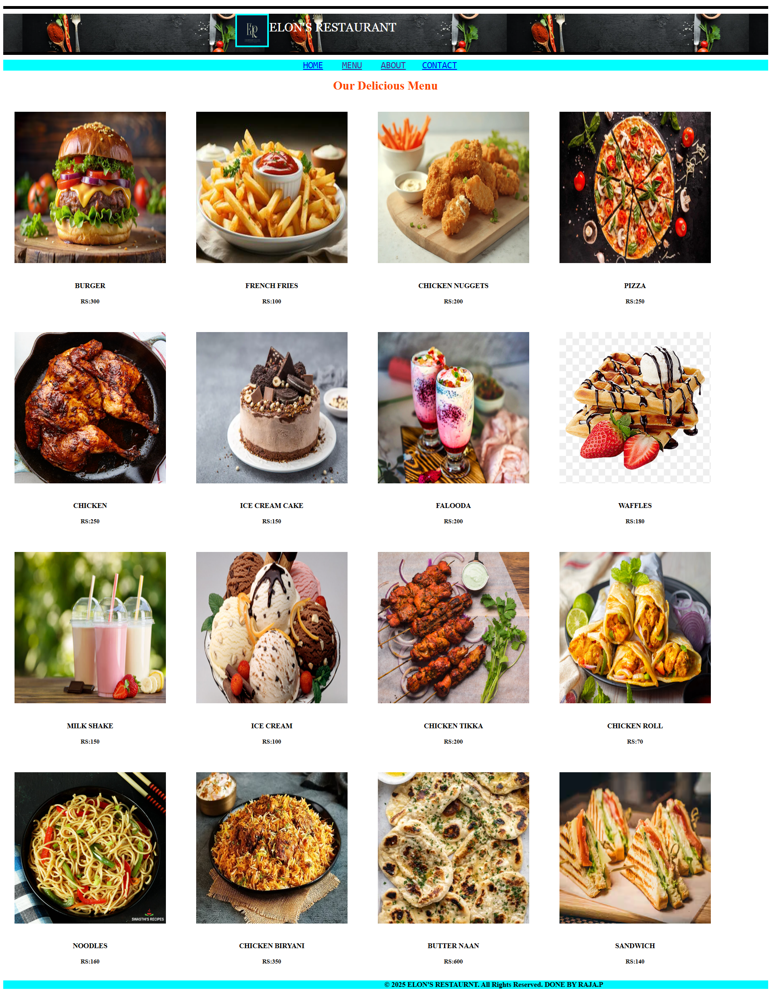
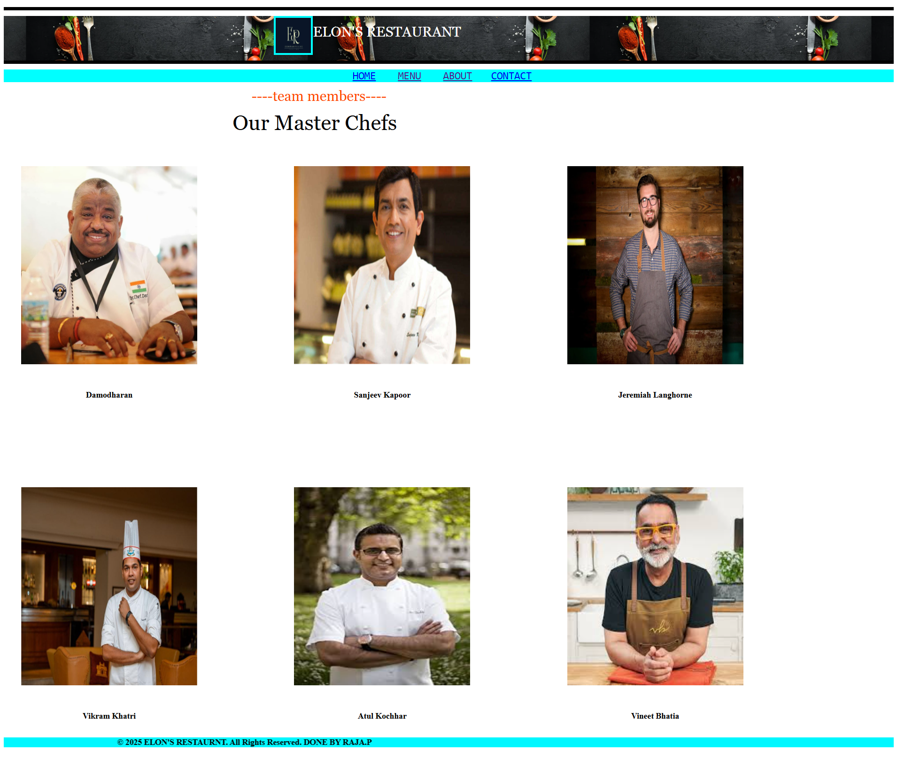
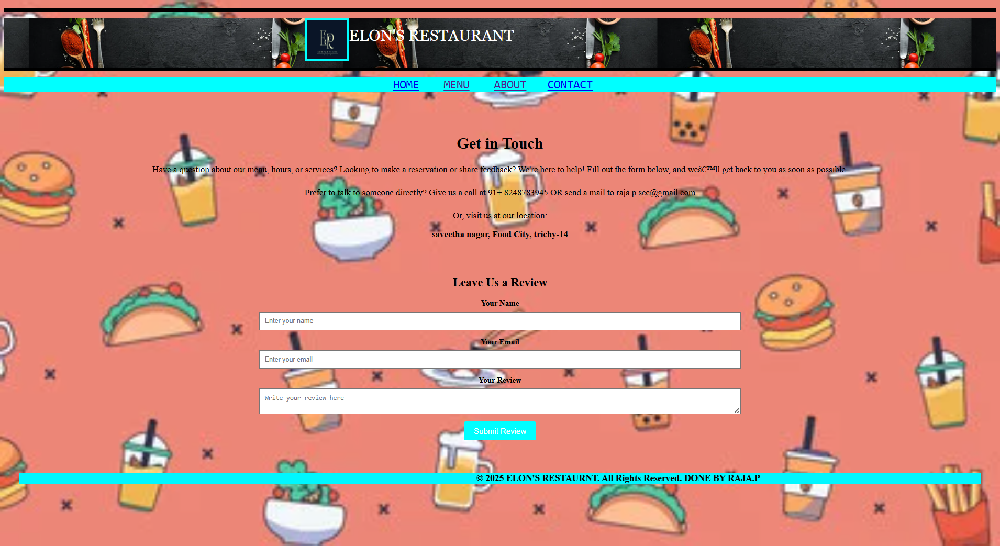

# Ex.07 Restaurant Website
# Date:30.04.2025
# AIM:
To develop a static Restaurant website to display the food items and services provided by them.

# DESIGN STEPS:
## Step 1:
Requirement collection.

## Step 2:
Creating the layout using HTML and CSS.

## Step 3:
Updating the sample content.

## Step 4:
Choose the appropriate style and color scheme.

## Step 5:
Validate the layout in various browsers.

## Step 6:
Validate the HTML code.

## Step 7:
Publish the website in the given URL.

# PROGRAM:
home.html
```
<HTML>
    <HEAD>
        <TI<!DOCTYPE html>
            <html>
            <head>
              <title>🍧🍨🧁🥞🧋ELON'S RESTAURANT🍧🍨🧁🥞🧋</title>
              <link rel="icon" href="er image.avif" type="er image.avif">
              <style>
                body {
                  background: url('background image.webp') no-repeat center center;
                  background-size: cover;
                  font-family: 'Georgia', 'Times New Roman', Times, serif;
                  margin: 0;
                  padding: 0;
                }
            
                header {
                  background: url('head image.jpg') center/cover no-repeat;
                  color: white;
                  padding: 20px;
                  text-align: center;
                }
            
                .nav {
                  background-color: aqua;
                  text-align: center;
                  padding: 15px;
                }
            
                .nav a {
                  font-size: 24px;
                  margin: 0 20px;
                  text-decoration: none;
                  color: black;
                }
            
                .special-offer {
                  background-image: url('images/123.jpg');
                  background-size: cover;
                  color: white;
                  padding: 40px;
                  text-align: center;
                }
            
                .special-offer h1 {
                  font-size: 60px;
                }
            
                .special-offer p {
                  font-size: 24px;
                  color: #02eeff;
                }
            
                footer {
                  background-color: #00f7ff;
                  text-align: center;
                  padding: 10px;
                  font-weight: bold;
                }
              </style>
            </head>
            <BODY background="c:\Users\admin\Downloads\forter-webinar.jpg.imgix.banner.jpg">
                <HR SIZE="7" COLOR="BLACK">
                <header style="background-image: url('head image.jpg'); background-position: center; color: rgb(255, 255, 255);">
                <PRE>                                                                                      <FONT SIZE="6">ELON'S RESTAURANT</FONT></PRE>
                <HR SIZE="7" COLOR="BLACK">
                </header>
                <header>
                    <pre style="background-color: aqua;">                                                                                                               <A HREF="HOME.HTML" style="font-size: 24px;">HOME</A>       <A href="MENU.HTML" style="font-size: 24px;">MENU</A>       <A href="ADMINSTRATION.HTML" style="font-size: 24px;">ABOUT</A>      <A href="CONTACT.HTML" style="font-size: 24px;">CONTACT</A>                </pre>
                </header>
              <div class="special-offer">
                <h1>SPECIAL DIWALI OFFER</h1>
                <p><strike>30% OFF</strike> NOW AT 50% OFF</p>
                <p>Vegan/Vegetarian Nuggets: Made from plant-based proteins such as soy, pea protein, or wheat gluten.<br>
                Gluten-Free Nuggets: Use gluten-free breading for those with gluten sensitivities or celiac disease.<br>
                Spicy Nuggets: Incorporate hot spices or sauces into the breading for a spicier flavor.</p>
              </div>
            
              <footer>
                <marquee>&copy; 2025 ELON'S RESTAURANT. All Rights Reserved. DONE BY RAJA.P</marquee>
              </footer>
            
            </body>
            </html>
            

give totally looking like good


```

menu.html

```
<HTML>
    <HEAD>
        <TITLE>🍧🍨🧁🥞🧋ELON'S RESTAURANT🍧🍨🧁🥞🧋</TITLE>
        <LINK REL="ICON" HREF="raju/webapp/static/header image.jpg">
        <STYLE>
            BODY{
                background-repeat: no-repeat;
                background-position: center;
                background-size: cover;
                
            }
            font{
                font-family: Georgia, 'Times New Roman', Times, serif;
            }
            .container {
            display: grid;
            grid-template-columns: repeat(4, 1fr);
            gap: 20px;
            width: 90%;
            max-width: 1200px;
            }

           .item {
            text-align: center;
            }
           .item img {
            width: 400;
            height: 400;
            margin: 30PX;
            }       
        </STYLE>
    </HEAD>
    <BODY background="c:\Users\admin\Downloads\forter-webinar.jpg.imgix.banner.jpg">
        <HR SIZE="7" COLOR="BLACK">
        <header style="background-image: url('head image.jpg'); background-position: center; color: rgb(255, 255, 255);">
        <PRE>                                                                                      <FONT SIZE="6">ELON'S RESTAURANT</FONT></PRE>
        <HR SIZE="7" COLOR="BLACK">
        </header>
        <header>
            <pre style="background-color: aqua;">                                                                                                               <A HREF="HOME.HTML" style="font-size: 24px;">HOME</A>       <A href="MENU.HTML" style="font-size: 24px;">MENU</A>       <A href="ADMINSTRATION.HTML" style="font-size: 24px;">ABOUT</A>      <A href="CONTACT.HTML" style="font-size: 24px;">CONTACT</A>                </pre>
        </header>
        <center><h1 style="color: orangered;">Our Delicious Menu</h1></center>
        <div class="container">
            <DIV CLASS="item">
                
                <H3>BURGER</H3>
                <H4>RS:300</H4>
            </DIV>
            <DIV CLASS="item">
                
                <h3>FRENCH FRIES</h3>
                <H4>RS:100</H4>
            </DIV>
            
            <DIV CLASS="item">
                
                <H3>CHICKEN NUGGETS</H3>
                <H4>RS:200</H4>
            </DIV>

            <DIV CLASS="item">
                
                <H3>PIZZA</H3>
                <H4>RS:250</H4>
            </DIV>
            
            <DIV CLASS="item">
                
                <H3>CHICKEN</H3>
                <H4>RS:250</H4>
            </DIV>

            <DIV CLASS="item">
                
                <H3>ICE CREAM CAKE</H3>
                <H4>RS:150</H4>   
            </DIV>

            <DIV CLASS="item">
                
                <H3>FALOODA</H3>
                <H4>RS:200</H4>
            </DIV>

            <DIV CLASS="item">
                
                <H3>WAFFLES</H3>
                <H4>RS:180</H4>
            </DIV>

            <DIV CLASS="item">
                
                <H3>MILK SHAKE</H3>
                <H4>RS:150</H4>
            </DIV>

            <DIV CLASS="item">
                
                <H3>ICE CREAM</H3>
                <H4>RS:100</H4>
            </DIV>

            <DIV CLASS="item">
                
                <H3>CHICKEN TIKKA</H3>
                <H4>RS:200</H4>
            </DIV>
            
            <DIV CLASS="item">
                
                <H3>CHICKEN ROLL</H3>
                <H4>RS:70</H4>
            </DIV>

            <DIV CLASS="item">
                
                <H3>NOODLES</H3>
                <H4>RS:160</H4>
            </DIV>
            
            <DIV CLASS="item">
                
                <H3>CHICKEN BIRYANI</H3>
                <H4>RS:350</H4>
            </DIV>

            <DIV CLASS="item">
                
                <H3>BUTTER NAAN</H3>
                <H4>RS:600</H4>
            </DIV>
            
            <DIV CLASS="item">
                
                <H3>SANDWICH</H3>
                <H4>RS:140</H4>
            </DIV>
            
        </div>
    <footer>
        <h3 style="background-color: rgb(0, 247, 255); color: rgb(0, 0, 0); font: bold;"><MARQUEE>&copy; 2025 ELON'S RESTAURNT. All Rights Reserved. DONE BY RAJA.P</MARQUEE></h3>
    </footer>
        </BODY>
</HTML>

```

adminstration.html

```
<HTML>
    <HEAD>
        <TITLE>🍧🍨🧁🥞🧋ELON'S RESTAURANT🍧🍨🧁🥞🧋</TITLE>
        <LINK REL="ICON" HREF="c:\Users\admin\Downloads\header image.jpg">
        <STYLE>
            BODY{
                background-repeat: no-repeat;
                background-position: center;
                background-size: cover;
                
            }
            font{
                font-family: Georgia, 'Times New Roman', Times, serif;
            }
            .container {
            display: grid;
            grid-template-columns: repeat(3, 1fr);
            gap: 140px;
            width: 200%;
            max-width: 1300px;
            }

           .item {
            text-align: center;
            
            
            }
           .item img {
            width: 400;
            height: 450;
            margin: 40PX;
            }   
        </STYLE>
    </HEAD>
    <BODY background="c:\Users\admin\Downloads\forter-webinar.jpg.imgix.banner.jpg">
        <HR SIZE="7" COLOR="BLACK">
        <header style="background-image: url('head image.jpg'); background-position: center; color: rgb(255, 255, 255);">
        <PRE>                                                                                      <FONT SIZE="6">ELON'S RESTAURANT</FONT></PRE>
        <HR SIZE="7" COLOR="BLACK">
        </header>
        <header>
            <pre style="background-color: aqua;">                                                                                                               <A HREF="HOME.HTML" style="font-size: 24px;">HOME</A>       <A href="MENU.HTML" style="font-size: 24px;">MENU</A>       <A href="ADMINSTRATION.HTML" style="font-size: 24px;">ABOUT</A>      <A href="CONTACT.HTML" style="font-size: 24px;">CONTACT</A>                </pre>
        </header>
        <pre ><font style="font-family: Georgia, 'Times New Roman', Times, serif; color: orangered; " size="6">                                                                         ----team members----</font><br>
        <font style="font-family: Georgia, 'Times New Roman', Times, serif; color: rgb(0, 0, 0); " size="7">                                        Our Master Chefs</font></pre>
           <br>
    <div class="container">
        <DIV CLASS="item">
            
            <H3>Damodharan</H3>
        </DIV>

        <DIV CLASS="item">
            
            <H3>Sanjeev Kapoor</H3>
        </DIV>
        
        <DIV CLASS="item">
            
            <H3>Jeremiah Langhorne</H3>
        </DIV>

        <DIV CLASS="item">
            
            <H3>Vikram Khatri</H3>
        </DIV>

        <DIV CLASS="item">
            
            <H3>Atul Kochhar</H3>
        </DIV>

        <DIV CLASS="item">
            
            <H3>Vineet Bhatia</H3>
        </DIV>
    </div>    
        <footer>
            <h3 style="background-color: rgb(0, 247, 255); color: rgb(0, 0, 0); font: bold;"><MARQUEE>&copy; 2025 ELON'S RESTAURNT. All Rights Reserved. DONE BY RAJA.P</MARQUEE></h3>
        </footer>
    </BODY>
</HTML>

```

contact.html

```
HEAD>
        <TITLE>🍧🍨🧁🥞🧋ELON'S RESTAURANT🍧🍨🧁🥞🧋</TITLE>
        <LINK REL="ICON" HREF="c:\Users\admin\Downloads\download.jpg">
        <STYLE>
            BODY{
                background-repeat: no-repeat;
                background-position: center;
                background-size: cover;
                
            }
            font{
                font-family: Georgia, 'Times New Roman', Times, serif;
            }
        </STYLE>
    </HEAD>
    <BODY background="400w-SbWGWjLueyw.webp">
        <HR SIZE="7" COLOR="BLACK">
        <header style="background-image: url('head image.jpg'); background-position: center; color: rgb(255, 255, 255);">
        <PRE>                                                                                      <FONT SIZE="6">ELON'S RESTAURANT</FONT></PRE>
        <HR SIZE="7" COLOR="BLACK">
        </header>
        <header>
            <pre style="background-color: aqua;">                                                                                                               <A HREF="HOME.HTML" style="font-size: 24px;">HOME</A>       <A href="MENU.HTML" style="font-size: 24px;">MENU</A>       <A href="ADMINSTRATION.HTML" style="font-size: 24px;">ABOUT</A>      <A href="CONTACT.HTML" style="font-size: 24px;">CONTACT</A>                </pre>
        </header>
        <br>
        <div style="text-align: center; padding: 30px; color: rgb(0, 0, 0);">
            <h2 style="font-size: 32px; margin-bottom: 20px;">Get in Touch</h2>
            <p style="font-size: 18px; margin-bottom: 15px; line-height: 1.6;">
                Have a question about our menu, hours, or services? Looking to make a reservation or share feedback? 
                We're here to help! Fill out the form below, and we’ll get back to you as soon as possible.
            </p>
            <p style="font-size: 18px; margin-bottom: 15px; line-height: 1.6;">
                Prefer to talk to someone directly? Give us a call at 91+ 8248783945 OR send a mail to raja.p.sec@gmail.com
            </p>
            <p style="font-size: 18px; line-height: 1.6;">
                Or, visit us at our location:
                <strong style="display: block; margin-top: 10px;">saveetha nagar, Food City, trichy-14</strong>
                <div>
                    <div style="text-align: center; margin: 30px auto; width: 50%; padding: 20px; ">
                        <h2 style="margin-bottom: 20px;">Leave Us a Review</h2>
                        <form>
                            <label for="name" style="display: block; margin-bottom: 8px; font-weight: bold;">Your Name</label>
                            <input type="text" id="name" name="name" placeholder="Enter your name" required style="width: 100%; padding: 10px; margin-bottom: 15px; ">
                
                            <label for="email" style="display: block; margin-bottom: 8px; font-weight: bold;">Your Email</label>
                            <input type="email" id="email" name="email" placeholder="Enter your email" required style="width: 100%; padding: 10px; margin-bottom: 15px; ">
                
                            <label for="review" style="display: block; margin-bottom: 8px; font-weight: bold;">Your Review</label>
                            <textarea id="review" name="review" placeholder="Write your review here" required style="width: 100%; padding: 10px; margin-bottom: 15px;"></textarea>
                
                            <button type="submit" style="padding: 10px 20px; background-color: aqua; color: white; border: none; border-radius: 4px; cursor: pointer; font-size: 16px;">Submit Review</button>
                        </form>
                    </div>
        </div>
        
        <footer>
            <h3 style="background-color: rgb(0, 247, 255); color: rgb(0, 0, 0); font: bold;"><MARQUEE>&copy; 2025 ELON'S RESTAURNT. All Rights Reserved. DONE BY RAJA.P</MARQUEE></h3>
        </footer>
    </BODY>
</HTML>
```
# OUTPUT:




# RESULT:
The program for designing software company website using HTML and CSS is completed successfully.
